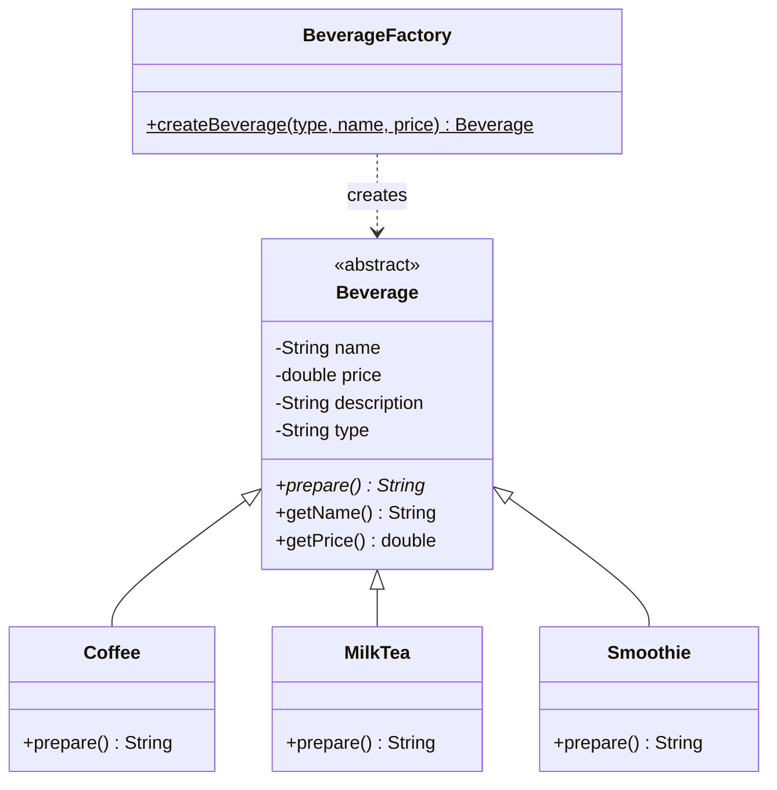
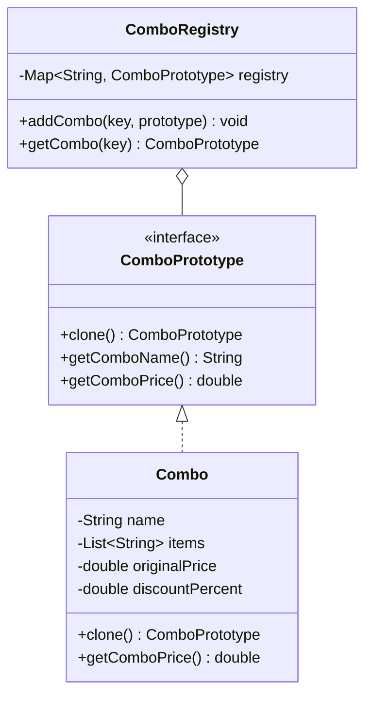
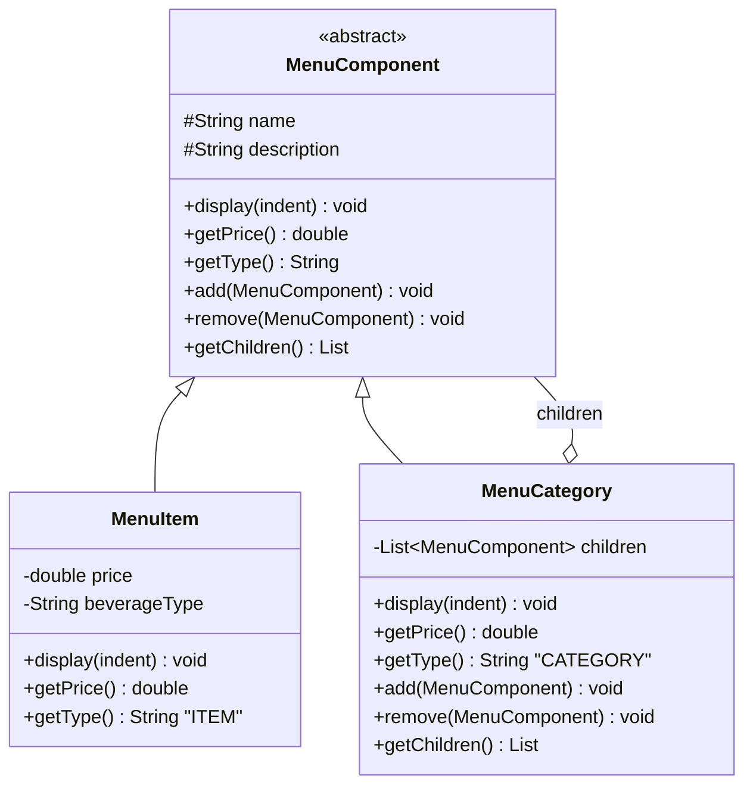
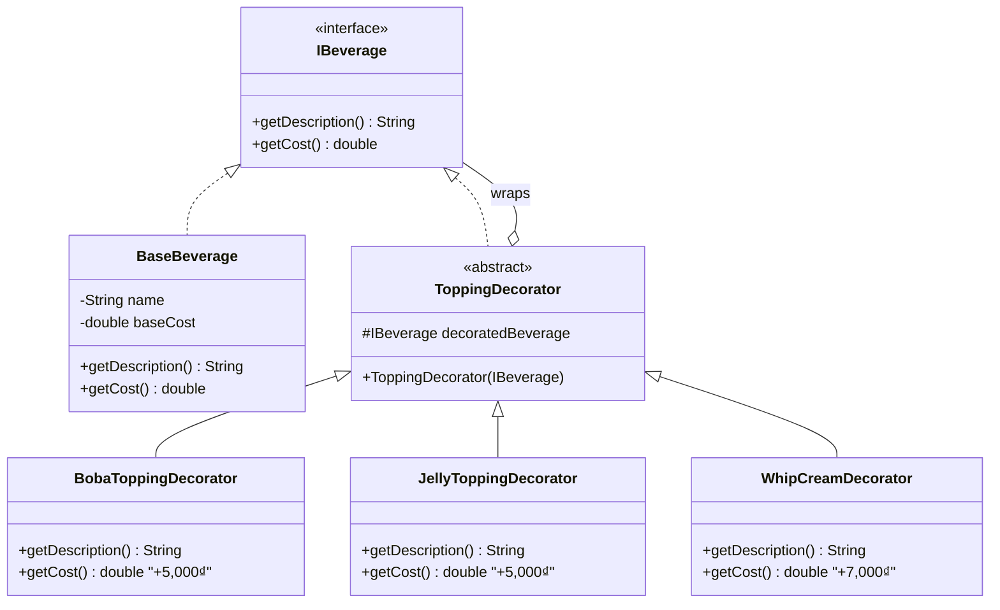
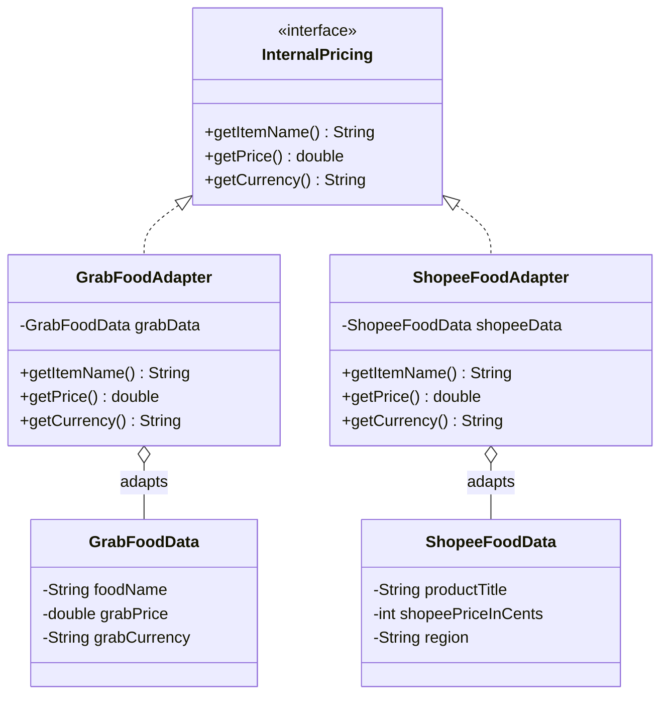
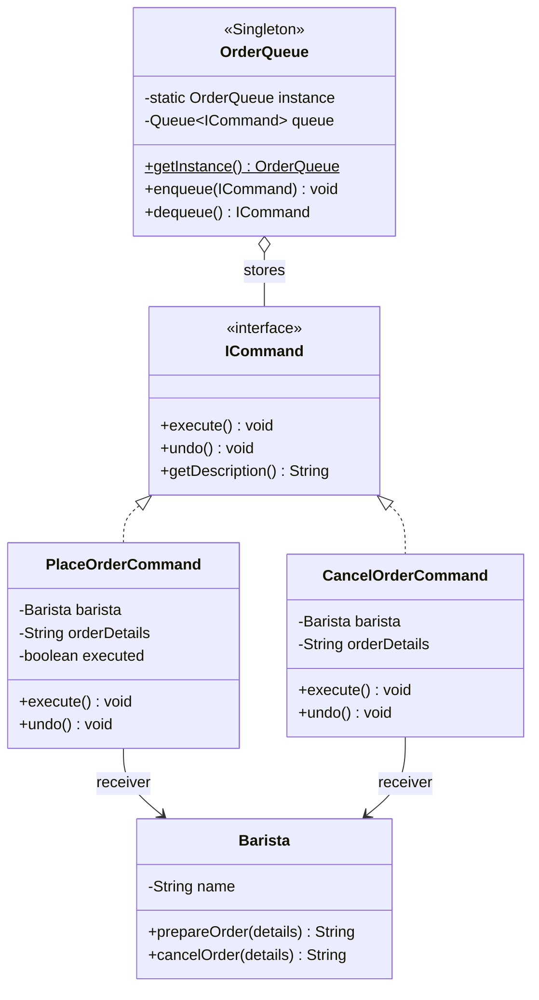
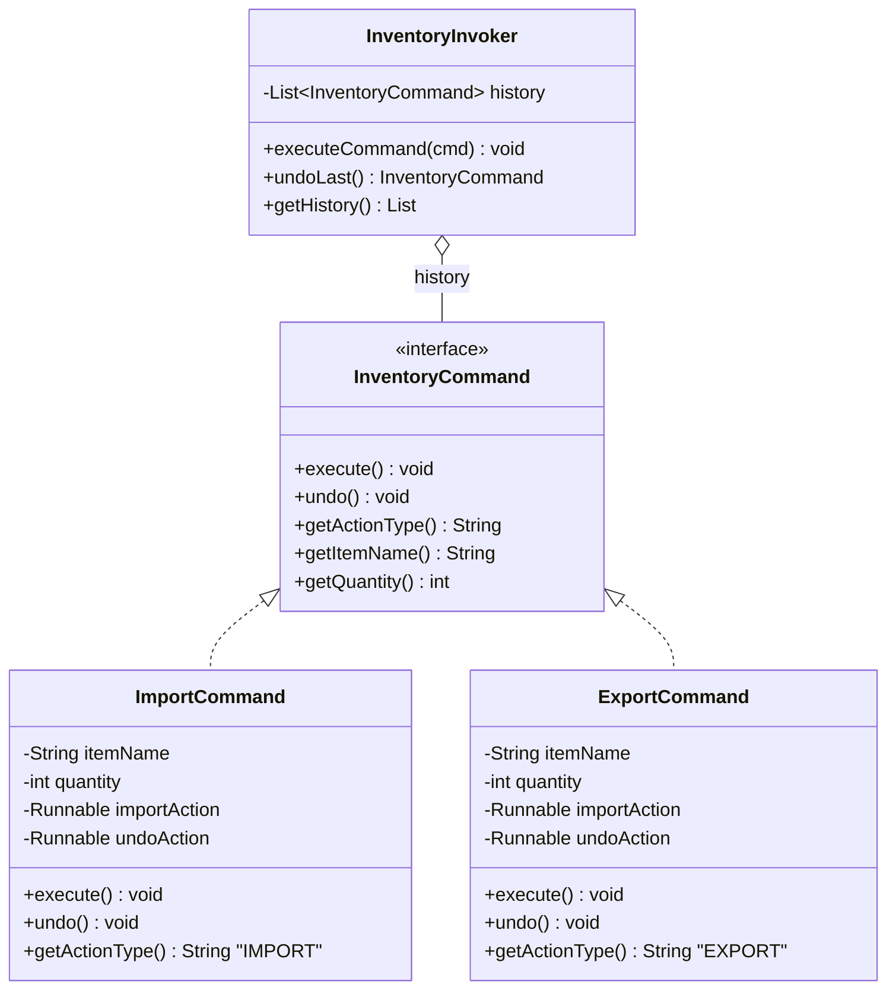
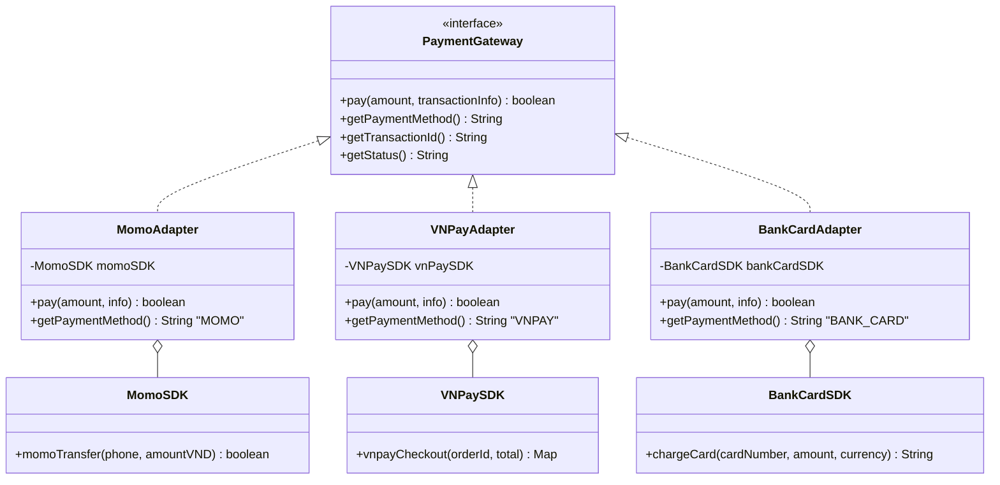

# ☕ Coffee Shop Management System - Giải thích Chi tiết Design Patterns

> **Tài liệu này giải thích logic, luồng chạy và cách áp dụng 7 Design Patterns vào hệ thống quản lý quán cà phê.**
> Mỗi phân hệ được mô tả kèm Class Diagram (Mermaid), ví dụ luồng chạy cụ thể, và lý do chọn pattern.

---

## 📋 Mục lục

1. [Tổng quan Kiến trúc](#1-tổng-quan-kiến-trúc)
2. [Phân hệ 1: Menu & Khởi tạo Món ăn](#2-phân-hệ-1-menu--khởi-tạo-món-ăn)
3. [Phân hệ 2: Tính Tiền & Topping](#3-phân-hệ-2-tính-tiền--topping)
4. [Phân hệ 3: Gọi món & Xếp hàng chờ](#4-phân-hệ-3-gọi-món--xếp-hàng-chờ)
5. [Phân hệ 4: Quản lý Kho & Lịch sử](#5-phân-hệ-4-quản-lý-kho--lịch-sử)
6. [Phân hệ 5: Thanh toán & Vận hành](#6-phân-hệ-5-thanh-toán--vận-hành)
7. [Tổng kết Pattern Usage](#7-tổng-kết-pattern-usage)

---

## 1. Tổng quan Kiến trúc

### 1.1 Công nghệ sử dụng

| Layer | Công nghệ | Mục đích |
|-------|-----------|----------|
| Frontend | React 18 + Vite | Giao diện người dùng (POS Dashboard) |
| Backend | Spring Boot 3.4.x | REST API + Business Logic |
| Database | MySQL 8.x + JPA Hibernate | Lưu trữ dữ liệu vĩnh viễn |
| Patterns | 7 Design Patterns (GoF) | Kiến trúc phần mềm linh hoạt |

### 1.2 Kiến trúc tổng thể

```
┌─────────────────────────────────────────────────────────────┐
│                    FRONTEND (React + Vite)                   │
│  Dashboard │ Menu │ Orders │ Inventory │ Payments            │
└──────────────────────────┬──────────────────────────────────┘
                           │ REST API (JSON)
                           ▼
┌─────────────────────────────────────────────────────────────┐
│                 BACKEND (Spring Boot)                         │
│  ┌─────────────┐  ┌──────────────┐  ┌────────────────────┐  │
│  │ Controllers  │→│   Services   │→│  Design Patterns    │  │
│  │ (REST API)   │  │ (Logic)      │  │  (Factory, Proto,  │  │
│  └─────────────┘  └──────────────┘  │   Decorator, Cmd,  │  │
│                          │           │   Singleton, Comp,  │  │
│                          ▼           │   Adapter)          │  │
│                   ┌──────────────┐  └────────────────────┘  │
│                   │ Repositories │                            │
│                   │ (JPA/ORM)    │                            │
│                   └──────┬───────┘                            │
└──────────────────────────┼───────────────────────────────────┘
                           │ SQL
                           ▼
                  ┌──────────────────┐
                  │  MySQL Database   │
                  │  coffeeshop_db    │
                  └──────────────────┘
```

### 1.3 Bảng phân bổ 7 Patterns trong 5 Phân hệ

| Pattern | Phân hệ 1 | Phân hệ 2 | Phân hệ 3 | Phân hệ 4 | Phân hệ 5 |
|---------|:---------:|:---------:|:---------:|:---------:|:---------:|
| **Factory Method** | ✅ Tạo đồ uống | ✅ Tạo hóa đơn | | | |
| **Prototype** | ✅ Clone combo | | | | ✅ Clone biên lai |
| **Decorator** | | ✅ Topping giá | ✅ Priority order | | |
| **Command** | | | ✅ Phiếu order | ✅ Nhập/Xuất kho | |
| **Singleton** | | | ✅ Hàng đợi | ✅ Quản lý kho | ✅ Máy in |
| **Composite** | ✅ Cây menu | | | ✅ Cây kho | |
| **Adapter** | | ✅ Giá bên thứ 3 | | | ✅ Cổng thanh toán |

---

## 2. Phân hệ 1: Menu & Khởi tạo Món ăn

### 2.1 Factory Method — Tạo đồ uống

**Vấn đề:** Quán có nhiều loại đồ uống (Cà phê, Trà sữa, Sinh tố), mỗi loại có cách pha chế khác nhau. Nếu dùng `if-else` để tạo object sẽ vi phạm Open-Closed Principle.

**Giải pháp:** Dùng Factory Method Pattern — một phương thức tĩnh `createBeverage(type)` tự động trả về đúng object.



**Luồng chạy:**

```
1. Nhân viên chọn loại đồ uống trên giao diện: "COFFEE"
2. Frontend gọi POST /api/menu/beverage { type: "COFFEE", name: "Cà phê sữa đá", price: 29000 }
3. MenuController → MenuService.createBeverage(request)
4. MenuService gọi: BeverageFactory.createBeverage("COFFEE", "Cà phê sữa đá", 29000)
5. Factory kiểm tra type → trả về new Coffee("Cà phê sữa đá", 29000)
6. Service lưu vào DB (MenuComponentEntity với beverageType="COFFEE")
7. Trả về JSON response cho Frontend
```

**Tại sao dùng Factory Method?**
- Khi thêm loại đồ uống mới (ví dụ: Nước ép), chỉ cần:
  1. Tạo class `Juice extends Beverage`
  2. Thêm 1 case trong Factory
- Không cần sửa bất kỳ code nào khác → đúng nguyên tắc **Open-Closed Principle**

---

### 2.2 Prototype — Nhân bản Combo

**Vấn đề:** Quán có các Combo mẫu (Combo Bữa Sáng = Cà phê + Bánh Croissant, giảm 10%). Mỗi khi khách đặt combo, nếu tạo lại từ đầu sẽ tốn tài nguyên và dễ sai.

**Giải pháp:** Lưu combo mẫu làm Prototype, khi cần chỉ `clone()` ra bản sao.



**Luồng chạy:**

```
1. Quản lý tạo Combo mẫu "Combo Bữa Sáng" (isTemplate=true, lưu DB)
2. ComboRegistry lưu prototype: registry.put("combo_bua_sang", comboTemplate)

3. Khách A đặt Combo Bữa Sáng:
   → Frontend gọi POST /api/menu/combo/clone/1
   → Service: comboRegistry.getCombo("combo_bua_sang")
   → Registry trả về: comboTemplate.clone()  ← DEEP COPY
   → Bản clone có isTemplate=false, clonedFromId=1
   → Lưu bản clone vào DB → Trả về cho khách A

4. Khách B cũng đặt Combo Bữa Sáng:
   → Lặp lại bước 3, tạo bản clone MỚI, độc lập với khách A
```

**Deep Clone vs Shallow Clone:**
- **Shallow Clone**: Copy reference → thay đổi bản sao ảnh hưởng bản gốc (NGUY HIỂM)
- **Deep Clone** (ta dùng): Tạo List mới chứa copy của từng item → hai bản hoàn toàn độc lập

```java
@Override
public ComboPrototype clone() {
    Combo cloned = new Combo();
    cloned.name = this.name;
    cloned.items = new ArrayList<>(this.items);  // ← DEEP COPY list
    cloned.originalPrice = this.originalPrice;
    cloned.discountPercent = this.discountPercent;
    return cloned;
}
```

---

### 2.3 Composite — Cấu trúc Menu dạng cây

**Vấn đề:** Menu quán có cấu trúc phân cấp: Menu → Danh mục → Món lẻ. Cần thao tác thống nhất (hiển thị, tính tổng giá) trên cả danh mục lẫn món lẻ.

**Giải pháp:** Composite Pattern — xử lý đồng nhất Leaf (Món lẻ) và Composite (Danh mục).



**Cấu trúc cây thực tế:**

```
🏠 Menu Quán Cà Phê
├── ☕ Đồ uống nóng
│   ├── Cà phê sữa đá — 29,000₫
│   └── Cà phê đen — 25,000₫
├── 🧊 Đồ uống lạnh
│   ├── Trà sữa Oolong — 35,000₫
│   ├── Trà sữa Truyền thống — 30,000₫
│   ├── Sinh tố Bơ — 40,000₫
│   └── Sinh tố Dâu — 38,000₫
└── 🍰 Bánh ngọt
    ├── Bánh Croissant — 25,000₫
    └── Bánh Tiramisu — 35,000₫
```

**Sức mạnh Composite:** Gọi `getPrice()` trên bất kỳ node nào:
- Trên `MenuItem("Cà phê đen")` → trả về `25,000₫`
- Trên `MenuCategory("Đồ uống lạnh")` → tự động đệ quy cộng tổng = `143,000₫`
- Trên Root → tổng toàn bộ menu

---

## 3. Phân hệ 2: Tính Tiền & Topping

### 3.1 Decorator (Cốt lõi) — Tính tiền Topping

**Vấn đề:** Mỗi đồ uống có thể thêm nhiều topping tùy ý. Nếu tạo class cho mọi tổ hợp (TraSua_TranChau, TraSua_Thach, TraSua_TranChau_Thach...) sẽ bùng nổ số lượng class.

**Giải pháp:** Decorator Pattern — mỗi topping là một lớp "bọc" quanh đồ uống gốc.



**Ví dụ luồng tính tiền:**

```
Khách gọi: Trà sữa + Trân châu + Thạch

Bước 1: IBeverage drink = new BaseBeverage("Trà sữa", 30000);
         drink.getCost() = 30,000₫
         drink.getDescription() = "Trà sữa"

Bước 2: drink = new BobaToppingDecorator(drink);
         drink.getCost() = 30,000 + 5,000 = 35,000₫
         drink.getDescription() = "Trà sữa + Trân châu"

Bước 3: drink = new JellyToppingDecorator(drink);
         drink.getCost() = 35,000 + 5,000 = 40,000₫
         drink.getDescription() = "Trà sữa + Trân châu + Thạch"

→ Tổng: 40,000₫
```

**Sơ đồ đóng gói (Wrapping):**

```
┌──────────────────────────────────────┐
│  JellyToppingDecorator (+5,000₫)     │
│  ┌────────────────────────────────┐  │
│  │  BobaToppingDecorator (+5,000₫)│  │
│  │  ┌──────────────────────────┐  │  │
│  │  │  BaseBeverage (30,000₫)  │  │  │
│  │  │  "Trà sữa"              │  │  │
│  │  └──────────────────────────┘  │  │
│  └────────────────────────────────┘  │
└──────────────────────────────────────┘
getCost() = 30,000 + 5,000 + 5,000 = 40,000₫
```

---

### 3.2 Factory Method — Tạo hóa đơn

**Luồng chạy:**

```
1. Khách lẻ → BillFactory.createBill("STANDARD", orderId, "Nguyễn Văn A", 120000)
   → Trả về StandardInvoice (hóa đơn đơn giản, không có mã số thuế)

2. Công ty → BillFactory.createBill("VAT", orderId, "Cty ABC", 500000, "Cty ABC", "0123456789")
   → Trả về VATInvoice (hóa đơn đỏ, có tên công ty, mã số thuế, thuế VAT 10%)
   → taxAmount = 500000 * 10% = 50,000₫
   → total = 500,000 + 50,000 = 550,000₫
```

---

### 3.3 Adapter — Chuyển đổi giá bên thứ 3

**Vấn đề:** GrabFood và ShopeeFood gửi dữ liệu giá theo format khác nhau. Grab dùng `grabPrice` (VND), Shopee dùng `shopeePriceInCents` (cents).



**Luồng chuyển đổi:**

```
GrabFood API gửi: { "foodName": "Cà phê", "grabPrice": 35000.0, "grabCurrency": "VND" }
→ GrabFoodAdapter wraps GrabFoodData
→ adapter.getPrice() → 35000.0 (đã đúng VND)

ShopeeFood API gửi: { "productTitle": "Trà sữa", "shopeePriceInCents": 3500000, "region": "VN" }
→ ShopeeFoodAdapter wraps ShopeeFoodData
→ adapter.getPrice() → 3500000 / 100 = 35000.0 (chuyển cents → VND)

→ Cả hai đều trả về InternalPricing chuẩn → hệ thống xử lý đồng nhất
```

---

## 4. Phân hệ 3: Gọi món & Xếp hàng chờ

### 4.1 Command — Phiếu Order

**Vấn đề:** Cần đóng gói mỗi yêu cầu gọi món thành một đối tượng độc lập, có thể lưu trữ, xếp hàng, và hoàn tác.



**Luồng gọi món:**

```
1. Khách gọi: "Trà sữa + Trân châu, 2 ly"
2. Frontend → POST /api/orders { customerName: "Anh Khách", items: [...] }
3. OrderService:
   a. Tạo OrderEntity, lưu DB
   b. Tạo Command: cmd = new PlaceOrderCommand(barista, "Trà sữa + Trân châu x2")
   c. Đẩy vào hàng đợi: OrderQueue.getInstance().enqueue(cmd)
   d. Thực thi: cmd.execute() → Barista.prepareOrder("Trà sữa + Trân châu x2")
4. Order xuất hiện trên màn hình Barista (Frontend GET /api/orders/queue)

5. Nếu khách hủy:
   → DELETE /api/orders/{id}
   → cmd.undo() → Barista.cancelOrder(...)
   → Order status = CANCELLED
```

---

### 4.2 Singleton — Hàng đợi duy nhất

**Vấn đề:** Dù có nhiều nhân viên phục vụ bấm máy gọi món cùng lúc, tất cả order phải đổ về MỘT hàng đợi duy nhất.

```java
public class OrderQueue {
    private static volatile OrderQueue instance;  // volatile đảm bảo thread-safe
    private Queue<ICommand> queue;

    private OrderQueue() {  // Private constructor → không ai tạo được instance mới
        this.queue = new LinkedList<>();
    }

    public static OrderQueue getInstance() {
        if (instance == null) {                    // Check 1: tránh lock không cần thiết
            synchronized (OrderQueue.class) {
                if (instance == null) {            // Check 2: thread-safe
                    instance = new OrderQueue();
                }
            }
        }
        return instance;
    }
}
```

**Double-Checked Locking giải thích:**

```
Thread A: gọi getInstance() → instance == null → vào synchronized → instance == null → tạo mới
Thread B: gọi getInstance() → instance == null → chờ lock...
Thread A: tạo xong, release lock
Thread B: vào synchronized → instance != null → KHÔNG tạo mới → trả về instance đã có
Thread C: gọi getInstance() → instance != null → trả về ngay (không cần lock)
```

---

### 4.3 Decorator — Priority Order

**Luồng VIP:**

```
1. Nhân viên bật toggle "VIP ưu tiên" trên giao diện
2. Frontend → PUT /api/orders/{id}/priority
3. OrderService:
   a. IOrder order = new StandardOrder(id, "Khách VIP", items, total)
      order.isPriority() = false
      order.getDisplayColor() = "#FFFFFF"

   b. order = new PriorityDecorator(order)
      order.isPriority() = true
      order.getDisplayColor() = "#FF0000"  ← Đỏ
      order.getOrderDetails() = "⚡ [VIP ƯU TIÊN] Khách VIP: Trà sữa..."

4. Frontend nhận response → hiển thị order với viền đỏ trên màn hình Barista
```

---

## 5. Phân hệ 4: Quản lý Kho & Lịch sử

### 5.1 Composite — Cấu trúc kho

**Cấu trúc cây kho:**

```
📦 Kho Tổng
├── 📦 Khu Nguyên liệu Cà phê
│   ├── 📦 Thùng Cà phê
│   │   ├── Gói Arabica 500g — SL: 20
│   │   └── Gói Robusta 500g — SL: 15
│   └── 📦 Thùng Sữa
│       └── Hộp Sữa tươi 1L — SL: 50
├── 📦 Khu Nguyên liệu Trà
│   ├── Gói Trà Oolong 200g — SL: 30
│   └── Gói Trà Lài 200g — SL: 20
└── 📦 Khu Topping
    ├── Gói Trân châu 500g — SL: 25
    └── Gói Thạch 500g — SL: 18
```

**Sức mạnh `kiemTraSoLuong()`:**

```java
// Kiểm tra 1 gói lẻ:
goiArabica.kiemTraSoLuong()  → 20

// Kiểm tra cả Thùng Cà phê:
thungCaPhe.kiemTraSoLuong()  → 20 + 15 = 35  (đệ quy tổng children)

// Kiểm tra toàn bộ Khu Nguyên liệu Cà phê:
khuCaPhe.kiemTraSoLuong()    → 35 + 50 = 85  (đệ quy sâu hơn)

// Kiểm tra toàn bộ Kho:
khoTong.kiemTraSoLuong()     → 85 + 50 + 43 = 178
```

---

### 5.2 Command — Nhập/Xuất kho + Undo

**Đây là ứng dụng hay nhất của Command Pattern** — hỗ trợ hoàn tác (Undo).



**Luồng Nhập kho + Undo:**

```
1. Quản lý nhập 10 gói Arabica:
   → POST /api/inventory/import { itemId: 1, quantity: 10, performedBy: "Quản lý Minh" }
   → InventoryService:
     a. Lấy item: Arabica, currentQty = 20
     b. Tạo ImportCommand:
        - execute: () → item.quantity = 20 + 10 = 30
        - undo:    () → item.quantity = 30 - 10 = 20
     c. inventoryInvoker.executeCommand(cmd)
        → cmd.execute() → quantity: 20 → 30
        → Lưu cmd vào history list
     d. Lưu InventoryLogEntity: {action: IMPORT, qtyChanged: 10, before: 20, after: 30}
   → Arabica: 20 → 30 ✅

2. Ôi nhầm! Thực ra chỉ nhập 5 thôi. Quản lý bấm UNDO:
   → POST /api/inventory/undo
   → InventoryService:
     a. inventoryInvoker.undoLast()
        → Pop ImportCommand từ history
        → cmd.undo() → quantity: 30 → 20 (khôi phục!)
     b. Đánh dấu log: undone = true
   → Arabica: 30 → 20 ✅ (đã hoàn tác)

3. Quản lý nhập lại đúng 5:
   → POST /api/inventory/import { itemId: 1, quantity: 5, performedBy: "Quản lý Minh" }
   → Arabica: 20 → 25 ✅
```

---

### 5.3 Singleton — InventoryManagerSingleton

Tương tự OrderQueue, đảm bảo chỉ có MỘT instance quản lý kho. Tránh xung đột khi nhiều nhân viên cùng trừ/cộng nguyên liệu đồng thời.

---

## 6. Phân hệ 5: Thanh toán & Vận hành

### 6.1 Adapter — Cổng thanh toán

**Vấn đề:** Momo, VNPay, Thẻ ngân hàng — mỗi bên có SDK code khác nhau.



**Luồng thanh toán:**

```
1. Khách chọn thanh toán bằng Momo:
   → POST /api/payment/pay { orderId: 5, method: "MOMO", transactionInfo: "0901234567" }

2. PaymentService:
   a. Chọn adapter:
      switch(method):
        "MOMO"      → gateway = new MomoAdapter(new MomoSDK())
        "VNPAY"     → gateway = new VNPayAdapter(new VNPaySDK())
        "BANK_CARD" → gateway = new BankCardAdapter(new BankCardSDK())

   b. Gọi: gateway.pay(120000, "0901234567")
      → MomoAdapter.pay()
        → momoSDK.momoTransfer("0901234567", 120000)  ← SDK riêng của Momo
        → Trả về true (thành công)

   c. Lấy kết quả:
      gateway.getTransactionId() → "MOMO_TXN_1717312345"
      gateway.getStatus() → "SUCCESS"

   d. Lưu PaymentEntity → DB

   e. In hóa đơn:
      PrinterManager.getInstance().printReceipt(receiptContent)

3. Trả response JSON về Frontend
```

**Sức mạnh Adapter:** Khi quán thêm cổng thanh toán mới (ví dụ: ZaloPay):
1. Tạo `ZaloPaySDK` (mô phỏng SDK)
2. Tạo `ZaloPayAdapter implements PaymentGateway`
3. Thêm 1 case trong switch
→ Không cần sửa bất kỳ code thanh toán nào khác!

---

### 6.2 Singleton — Máy in

```java
PrinterManager.getInstance().printReceipt("=== HÓA ĐƠN ===\n...");
```

Đảm bảo mọi luồng thanh toán đều đẩy lệnh in về MỘT cổng duy nhất → tránh kẹt máy in khi quán đông.

---

### 6.3 Prototype — Biên lai điện tử

```
1. Hệ thống có EReceipt template (mẫu chuẩn):
   - storeName: "CaféShop"
   - address, hotline, thanksMessage (cố định)
   - customerName, totalAmount, dateTime, paymentMethod (rỗng, chờ điền)

2. Khi khách thanh toán xong:
   → EReceipt receipt = templateReceipt.clone()  ← Clone bản mẫu
   → receipt.fillDetails("Nguyễn Văn A", 120000, "MOMO", LocalDateTime.now())
   → Trả về receipt JSON cho Frontend hiển thị

3. Bản gốc KHÔNG bị ảnh hưởng → sẵn sàng clone cho khách tiếp theo
```

---

## 7. Tổng kết Pattern Usage

### 7.1 Tại sao dùng Design Pattern?

| Không dùng Pattern | Dùng Pattern |
|---------------------|-------------|
| Code spaghetti, if-else dài | Code modular, dễ mở rộng |
| Thêm tính năng = sửa nhiều file | Thêm tính năng = thêm 1-2 class |
| Khó test, khó debug | Dễ unit test từng component |
| Vi phạm SOLID | Tuân thủ SOLID |

### 7.2 Bảng tổng kết

| # | Pattern | Loại | Phân hệ | Ứng dụng cụ thể |
|---|---------|------|---------|-----------------|
| 1 | **Factory Method** | Creational | 1, 2 | Tạo đồ uống theo loại, tạo hóa đơn theo loại |
| 2 | **Prototype** | Creational | 1, 5 | Clone combo mẫu, clone biên lai template |
| 3 | **Singleton** | Creational | 3, 4, 5 | Hàng đợi order, quản lý kho, máy in |
| 4 | **Decorator** | Structural | 2, 3 | Tính topping giá, gắn cờ VIP order |
| 5 | **Composite** | Structural | 1, 4 | Cây menu, cây kho nguyên liệu |
| 6 | **Adapter** | Structural | 2, 5 | Chuyển giá Grab/Shopee, cổng thanh toán |
| 7 | **Command** | Behavioral | 3, 4 | Phiếu order → Barista, nhập/xuất kho + Undo |

### 7.3 Nguyên tắc SOLID được đảm bảo

- **S** (Single Responsibility): Mỗi class chỉ làm 1 việc (Factory chỉ tạo, Decorator chỉ bọc)
- **O** (Open-Closed): Thêm Topping/Đồ uống/Cổng TT mới = thêm class, không sửa code cũ
- **L** (Liskov Substitution): Coffee/MilkTea/Smoothie thay thế Beverage được
- **I** (Interface Segregation): IBeverage, IOrder, ICommand — interface nhỏ, chuyên biệt
- **D** (Dependency Inversion): Service phụ thuộc interface (PaymentGateway), không phụ thuộc SDK cụ thể

---

> **Tác giả:** Coffee Shop Management System
> **Ngày tạo:** 02/06/2026
> **Phiên bản:** 1.0 - Full-Stack (Spring Boot + React + MySQL)
